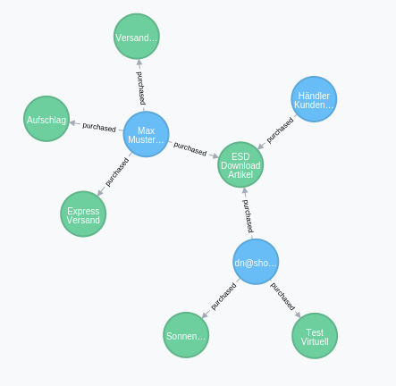

# DsnRecommendation
This is an example, WIP implementation of a recommendation engine for Shopware based on the
neo4j graph database.

# How to use
Get neo4j running
* Go to the [neo4j homepage](neo4j.com/download/) and download the neo4j server
* run the neo4j server (e.g. `./bin/neo4j run`)
* go to the neo4j backend and set / test your password (typically `http://localhost:7474`)

Get this plugin running
* install and activate this plugin in the plugin manager or from the console
* in your SW directory run `./bin/console dsn:neo4j:export` in order to export all your order data to neo4j

If everything went well, go to the neo4j backend (`http://localhost:7474`) and run this query: `MATCH (n) RETURN n`.
You should see an output like this:

# License

Please see [License File](LICENSE) for more information.