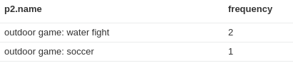

# DsnRecommendation
This is an example, WIP implementation of a recommendation engine for Shopware based on the
neo4j graph database.

# Why?
Recommendations are an ideal playing field for graph databases - so this is basically evaluating,
how such a product recommendation engine based on neo4j might look like in Shopware.

# How to use
Get neo4j running
* Go to the [neo4j homepage](neo4j.com/download/) and download the neo4j server
* run the neo4j server (e.g. `./bin/neo4j start`)
* go to the neo4j backend and set / test your password (typically `http://localhost:7474`)

Get this plugin running
* checkout this repo to `engine/Shopware/Plugins/Local/Core/DsnRecommendation`
* run `composer install` in the plugin directory
* add your neo4j credentials to the config.php file of your shopware shop:
```
    'neo4j' => array(
        'host' => 'localhost',
        'user' => 'neo4j',
        'pass' => 'shopware',
        'port' => ''
    )
```
* install and activate this plugin in the plugin manager or from the console
* in your SW directory run `./bin/console dsn:neo4j:export` in order to export all your order data to neo4j. Make sure
that you properly configured your shop domain for this, so that the neo4j server will be able to fetch the generated
CSV from your shop's HTTP address.

If everything went well, go to the neo4j backend (`http://localhost:7474`) and run this query: `MATCH (n) RETURN n`.
You should see an output like this:


This graphs shows four "purchasing group". The group at the bottom left is Shopware's
demo data.
The other three "purchase groups" are the demo data of this plugin: Each of this
groups simulates buying behaviour for another topic, e.g. "card and board games",
"computer games" and "outdoor games". The groups would be linked in reality,
for the purpose of debugging and experimenting around, smaller, separated groups
seem to be more useful.

# Demo data
In order to have some meaningful demo data, that makes checking the results easier,
there is a CLI tool command, that will create items, customers and orders:

```
./bin/console dsn:recommendation:demo
```

Be aware, that this is not recommended for production environments, as data might
be corrupted or overwritten. Furthermore the demo items / customers / orders
might have an implicit dependency on the Shopware developer demo data.

After running this script, you need to re-export your orders to neo4j:

```
./bin/console dsn:neo4j:export
```


# Status
Currently only the order data is exported, the actual recommendation queries are not yet implemented.
They might look like this

```
// find customer who ordered same items
MATCH (u:Customer)-[r1:purchased]->(p:Item)<-[r2:purchased]-(u2:Customer),
// find items of those customers
(u2:Customer)-[:purchased]->(p2:Item)
// only for this user
WHERE u.name = "Felix Frechmann"
// make sure, that the current user  didn't order that product, yet
AND not (u)-[:purchased]->(p2:Item)
// count / group by u2, so every user-path only counts once
RETURN p2.name, count(DISTINCT u2) as frequency
ORDER BY frequency DESC
```

and might result in something like this:



Looking at the graph example above, you will see, that this query
recommends "outdoor game: water fight" and "outdoor game: soccer" to the customer
"Felix Frechmann". The reasoning is basically the following:

* Felix bought "rope jumping" and "gold pro"
* So did Kathrin and Max
* Kathrin and Max also bought the game "wate fight"
* Kathrin bought the game "soccer"

So basically there are two paths to "water fight" and one path to "soccer"
for Felix. For this reason, the "water fight" recommendation is higher ranked
than the "soccer" recommendation.

# Read more
Find out more about this plugin and neo4j in general in the corresponding blog post: https://developers.shopware.com/blog/2015/10/14/graph-based-recommendation-engine-for-shopware/

# License

Please see [License File](LICENSE) for more information.
